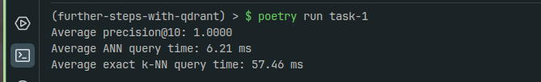

# Set up
Execute `poetry install` and `poetry run task-1`

# Takeaways
Successive executions yield always almost-identical results:

- Average $Precision_@k = 1.0000$, which is a sign of the `knn` and `ann` results overlapping everytime, i.e.: $ANN_r \cap KNN_r = KNN_r$, for this sample size.
- Average `ANN` query times were observed to be 10 times faster on average than `KNN` query times.
- There increase in performance comes at virtually zero cost, since the observed precision is 100%.

