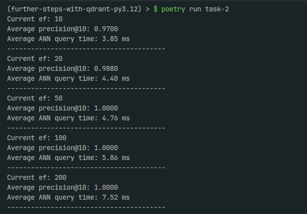

# Set up
Execute `poetry install` and `poetry run task-2`

# Takeaways
As observed in the results below:
- A 20x increase in the EF parameters adds a mere 3% gain in precision @ k = 10
- This 20x increase in EF comes at a cost of almost 2x average query time for ANN.
- It is also worth noting that, although high in comparison with the average query times for ef = 10, 
the average query times for ANN @ ef = 100 achieve 100% efficiency on average, taking 10x less time than kNN.

