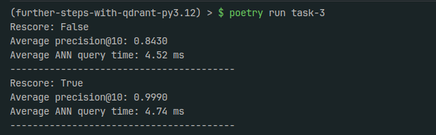

# Set up
Execute `poetry install` and `poetry run task-3`

# Takeaways
- Rescore seems to improve precision by around 15%, at a ~8% time premium. According to my research
this penalty of around ~20 ms makes sense given the size of the dataset (~13 Gb) and my loca storage speed (NVMe .m2 SSD).

